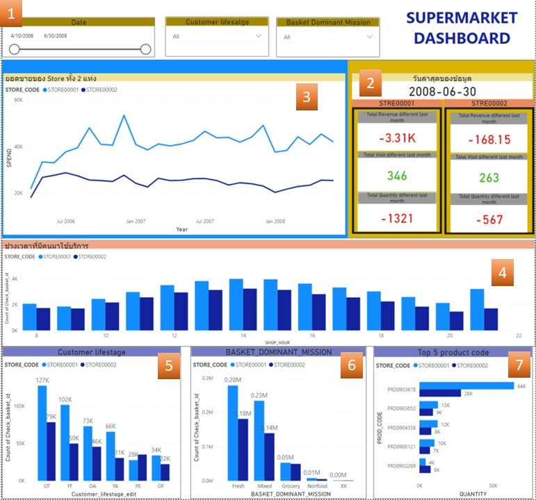

# CLV Dashborad
  
## Data set : Supermarket sales in Apr 2006 - Jul 2008

## Main Dashboard

### section 1 : Filter
   - Date 
   
   - Customer lifesatge 
      - OA  Older Adults
      - OF  Older Families
      - OT  Other
      - PE  Pensioners
      - YA  Yaung Aduults
      - YF  Young Families
      
    - Basket Dominant Mission
      - Fresh
      - Grocery
      - Mixed
      - Non Food
  filler Only section 3-7 ,can filter to find what Time of some tpye of customer lifesatge or tpye of Basket Dominant Mission mixzimum visit to plan promotion.
  
  ### section 2 : Show information about Total Revenue Total Visit and Total Quality different between last month and current month 
  
  ### section 3 : Revenue graph of 2 stores
  
  ### section 4 : Time with Total Visit
  
  ### section 5 : Customer Lifestage
  
  ### section 6 : Basket Dominant Mission
  
  ### section 7 : Top 5 Product code
