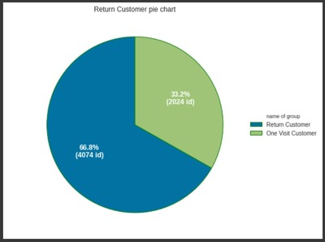
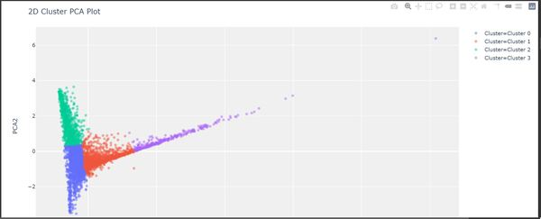
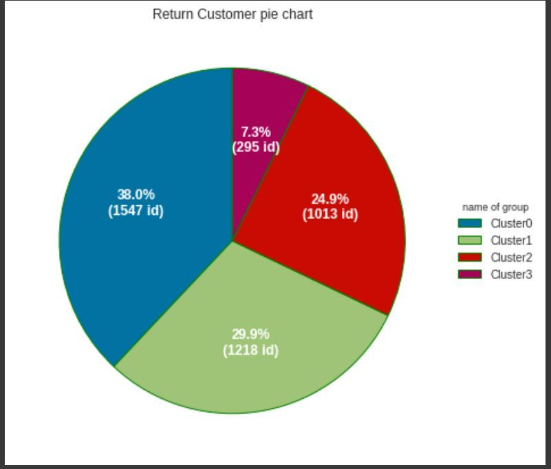
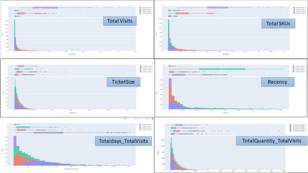
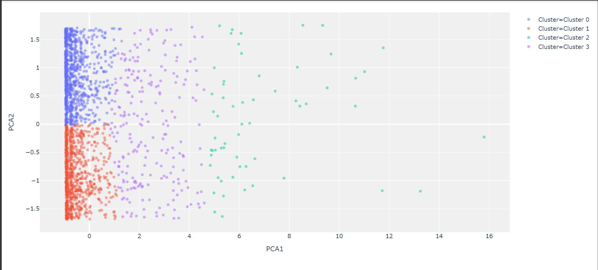
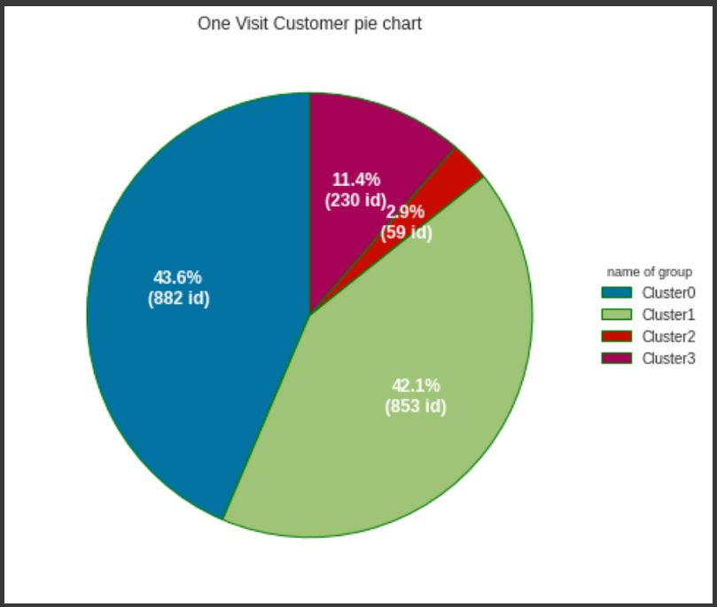
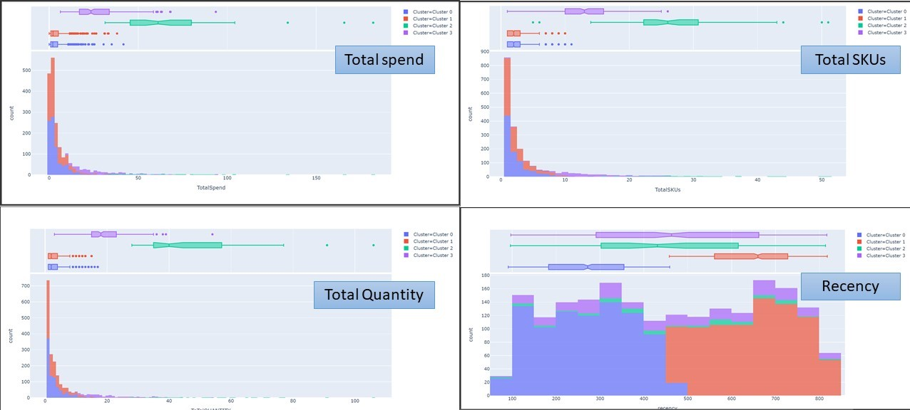

# Customer Segmentation

**Notebooks:** [Customer Segmentation](./Customer_Segmentation_Group_3.ipynb)  
**Google Colab:**   

## Data set : Supermarket data

## Type of Customer
   

   by separate to 2 groups
   1. Return customer (Visit more than 1 times)
   2. One visit customer

## Segmentation 1. Return customer (Visit more than 1 times) 

   ### Feature
   - Total visits = COUNT(DISTINCT BASKET ID)
   - Ticket size = SUM(SPEND)/COUNT(DISTINCT BASKET ID)
   - Total no. of SKUs
   - Recency = Maxday -Lastdate
   - Totaldays_TotalVisits = Totalday/TotalVisit
   - ToTalQUANTITY_TotalVisits = Total Quantity/Total Visit
   
   use kmeans  , n_clusters = 4
   
   
   
   
   
   
   ### Interpret results
   
   
   
   ### Plan for actions
   #### 1.) Cluster 0 : More Ticket size
จำนวนลูกค้า ~ 1,548 คน (~29.9% ของลูกค้าประจำ และ ~25.36 % ของลูกค้าทั้งหมด)

รายรับจากลูกค้า (Total spend) ของกลุ่ม 0 สูงเป็นลำดับที่ 3 ส่วนรายรับเฉลี่ยต่อคน (Ticket size) ของกลุ่ม 0 น้อยที่สุด

ลูกค้ามีระยะเวลา ~ 132 วันต่อ 1 transaction (~ 4.5 เดือน)

ลูกค้ามาที่ร้านครั้งล่าสุด (Recency) ~ 86 วันก่อน

ปริมาณที่ซื้อต่อครั้ง ~ 5.62 ชิ้น ต่อการมีใช้บริการ (ลำดับที่ 4)

Total visit = 5.45 ครั้ง (ลำดับที่ 3)

time be member = 609.75 (ลำดับที่ 3)

จากข้อมูลข้างต้น สรุปได้ว่าลูกค้ากลุ่มที่ 0 นี้มียอดซื้อรวมเป็นลำดับที่ 3 ปริมาณที่ซื้อต่อครั้งสูงเป็นลำดับที่ 3, ลูกค้ามาครั้งล่าสุดเมื่อ ~ 86 วันก่อน ระยะเวลาต่อ transaction ประมาณ ~ 4.5 เดือน วัน พบว่าลูกค้าหายไปนานจนผิดปกติ มีความเป็นไปได้ว่าลูกค้าอาจไปซื้อสินค้าจากร้านอื่น หรือเป็นกลุ่มที่เข้ามาซื้อของเพื่อเอา Promotion เป็นพวก bargain hunter เมื่อประกอบกับ total visit และ time be member น้อยเป็นลำดับที่ 3
หน้าที่ของเราคือ จัดการกลุ่ม bargain hunterและ ทำให้ลูกค้าที่ดีแต่ไปซื้อร้านอื่นกลับมา reactivate

   1.ทำ 2x2 matrix เพื่อจัดการกลุ่ม bargain hunter

   2.ทำ Recommend additional products เพื่อใช้ทำ product association analysis

   3.Spend stretch discount คือการซื้อสินค้าหนึ่งจะได้รับส่วนลดอีกสินค้าหนึ่ง

   #### 2.) Cluster 1 : More Engagement
จำนวนลูกค้า ~ 1,218 คน (~ 29.89 % ของลูกค้าประจำ และ ~ 19.96 % ของลูกค้าทั้งหมด)

รายรับจากลูกค้า (Total spend) และรายรับเฉลี่ยต่อคน (Ticket size) ของกลุ่ม 1 สูงเป็นลำดับที่ 2

ลูกค้ามีระยะเวลา ~ 30 วันต่อ 1 transaction (~ 1 เดือน)

ลูกค้ามาครั้งล่าสุด (Recency) เมื่อ ~ 27 วันก่อน

ปริมาณที่ซื้อต่อครั้ง ~ 12 ชิ้น ต่อการมีใช้บริการ (ลำดับที่ 2)

จากข้อมูลข้างต้น สรุปได้ว่าลูกค้ากลุ่มที่ 1 ลูกค้ากลุ่มนี้เป็นกลุ่มที่มียอดการซื้อสินค้าที่สูง, ปริมาณซื้อที่สูง, ลูกค้ากลุ่มนี้มีมาครั้งล่าสุด ~ 1 เดือนก่อนเมื่อเทียบกับ ระยะเวลาต่อ transaction ~ 1 เดือน ซึ่งยังอยู่ในช่วงเวลาไม่ผิดปกติ , มี Total visit มากที่สุด, ลูกค้ากลุ่มนี้เป็นสมาชิกมานานสูงเป็นลำดับที่ 2 จากทั้ง 4 กลุ่ม (Time be member)
หน้าที่ของเราคือ เพิ่ม Engagement เพื่อสร้างความสัมพันธ์ที่ดีในระยะยาว ระหว่างแบรนด์และลูกค้า

1.Influencer Marketing

2.Daily promotional specials

3.การให้ Coupons หลังการซื้อ โดยมีในระยะเวลาหมดอายุที่สั้นเพื่อกระตุ้นให้ลูกค้ากลับมาซื้อใหม่เร็วขึ้น ซื้อในปริมาณมากขึ้น

4.ทดสอบการตลาดกับกลุ่มควบคุม เพื่อยืนยันว่าการเข้าชมบ่อยขึ้นจะส่งผลให้รายได้รวมสูงขึ้นหรือระดับรายได้ทั้งหมดไม่เปลี่ยนแปลงมากนัก (ความถี่สูงขึ้น, มูลค่าต่อ transaction ที่ต่ำลง)

   #### 3.) Cluster 2 : Bargain Hunter
จำนวนลูกค้า ~ 1,013 คน (~24.86% ของลูกค้าประจำ และ ~16.6 % ของลูกค้าทั้งหมด)

รายรับจากลูกค้า (Total spend) ของกลุ่ม 2 น้อยที่สุด ส่วนรายรับเฉลี่ยต่อคน (Ticket size) ของกลุ่ม 1 เป็นลำดับที่ 3

ลูกค้ามีระยะเวลา ~ 38.21 วันต่อ 1 transaction (~ 1เดือน)

ลูกค้ามาครั้งล่าสุด (Recency) เมื่อ ~ 385 วันก่อน (~ 1 ปี 1 เดือน)

ปริมาณที่ซื้อต่อครั้ง ~ 6.92 ชิ้น (ลำดับที่ 3)

Total visit = 3.53 ครั้ง (ลำดับที่ 4)

time be member = 507.15 (ลำดับที่ 4)

จากข้อมูลข้างต้น สรุปได้ว่าลูกค้ากลุ่มที่ 2 เป็นกลุ่ม ลูกค้ากลุ่มนี้มียอดซื้อรวมสินค้าน้อยที่สุด ปริมาณที่ซื้อต่อครั้งสูงเป็นลำดับที่ 3 มาครั้งล่าสุดเมื่อ 1 ปีก่อน ระยะเวลาต่อ transsaction ประมาณ 38.21 วัน แสดงว่าลูกค้าหายไปนานจนผิดปกติ มีความเป็นไปได้ว่าลูกค้าอาจไปซื้อสินค้าจากร้านอื่น หรือเป็นกลุ่มที่เข้ามาซื้อของเพื่อเอา Promotion เป็นพวก bargain hunter เมื่อประกอบกับ total visit และ time be member น้อยที่สุดกว่ากลุ่มอื่น
หน้าที่ของเราคือ จัดการกลุ่ม bargain hunterและ ทำให้ลูกค้าที่ดีแต่ไปซื้อร้านอื่นกลับมา

1.ทำ 2x2 matrix เพื่อจัดการกลุ่ม bargain hunter

2.ให้ Coupon discount กลุ่มที่เป็นลูกค้าร้านอื่นเพื่อดึงมาซื้อร้าน

3.ทำ Churn analysis ดูลูกค้าว่าไปเป็นลูกค้าร้านไหน คู่แข่งเป็นใคร อะไรเป็นสิ่งที่ดึงลูกค้าไป

   #### 4.) Cluster 3 : Upper Class
มีจำนวนลูกค้า ~ 296 คน (~7.26% ของลูกค้าประจำ และ ~4.83 % ของลูกค้าทั้งหมด)

มีรายรับจากลูกค้า (Total spend) และรายรับเฉลี่ยต่อคน (Ticket size) ของกลุ่ม 3 สูงที่สุด

ลูกค้ามีมาในช่วงระยะเวลา ~ 6 วันต่อ 1 transaction

ลูกค้ามาครั้งล่าสุด (Recency) เมื่อ ~ 5 วันก่อน

ปริมาณที่ซื้อต่อครั้ง ~ 15 ชิ้น (ลำดับที่ 1)

จากข้อมูลข้างต้น สรุปได้ว่าลูกค้ากลุ่มที่ 3 นี้เป็นลูกค้าชั้นดี (Upper Class) มี Brand loyalty ต่อร้านค้านี้สูงเห็นได้จาก ลูกค้ากลุ่มนี้ซื้อสินค้ามียอดที่สูง, ปริมาณซื้อที่สูง, ลูกค้ากลุ่มนี้มาที่ร้านครั้งล่าสุด ~ 5 วัน (recency ที่ต่ำ) เทียบกับระยะเวลาการซื้อสินค้าต่อ transaction ~ 5 วัน ซึ่งทั้งสองสอดคล้องกันไม่ผิดปกติมี Total visit มากที่สุด, ลูกค้าเป็นสมาชิก (Time be member) มานานที่สุดจากทั้ง 4 กลุ่ม
หน้าที่ของเราคือต้องรักษาลูกค้ากลุ่มนี้เอาไว้ โดยใช้

1.Loyalty Program ให้ลูกค้า ซื้อซ้ำ Retention โดยใช้ระบบสมัครสมาชิก, บัตรสะสมแต้ม, Promotion แลกรับของรางวัลหรือ กิจกรรมต่าง ๆ ที่ช่วยกระตุ้นให้เกิดการกลับมาซื้อสินค้าและบริการซ้ำ

2.ทำ Up-selling เสนอขายสินค้าหรือบริการที่มีราคาสูงกว่าให้กับลูกค้าเพื่อเพิ่มยอดขาย
   
 
## Segmentation 2. One visit customer
  ### Feature
   - Total spend
   - Total no. of SKUs
   - Total Quantity
   - Recency
   
  use kmeans  , n_clusters = 4
   
   
   
   
   
   
   ### Interpret results
   
   
   
   
   ### Plan for actions
ผลลัพธ์จากการแบ่งกลุ่มของลูกค้าที่มาใช้บริการเพียง 1 ครั้งโดยใช้ KMeans Clustering สรุปได้ดังนี้

#### 1.) Cluster 0 : Invisible man
มีจำนวนลูกค้า ~ 860 คน (~42.51% ของลูกค้าที่เคยมาเพียง 1 ครั้ง และ ~14.11 % ของลูกค้าทั้งหมด)

มีรายรับจากลูกค้า (Total spend) ของกลุ่ม 0 ในระดับน้อย ( ~ 4.16 )

ความหลากหลายในการเลือกซื้อสินค้า (SKUs) น้อยอยู่ในระดับน้อย ( ~ 2 SKUs )

ปริมาณที่ซื้อต่อครั้งอยู่ในระดับน้อย ( ~ 3 ชิ้น )

ลูกค้ามาครั้งล่าสุด (Recency) เมื่อ ~ 650 วันก่อน **(~ 1 ปี 9 เดือน)

จากข้อมูลข้างต้น สรุปได้ว่าลูกค้ากลุ่มที่ 0 เป็นกลุ่ม ลูกค้าที่มียอดซื้อรวมสินค้าน้อย ปริมาณที่ซื้อต่อครั้งน้อย ซื้อสินค้าไม่หลากหลาย และมาใช้บริการเมื่อนานมากแล้ว

หน้าที่ของเราคือ
ไม่ทำอะไรเลย เพราะลูกค้าเป็นกลุ่ม Low Value และไม่ได้มาใช้บริการนานมากแล้ว อาจเป็นลูกค้าที่เเวะมาใช้บริการแค่ผ่านทาง

#### 2.) Cluster 1 : Top invisible man
มีจำนวนลูกค้า ~ 889 คน (~43.9% ของลูกค้าที่เคยมาเพียง 1 ครั้ง และ ~14.57 % ของลูกค้าทั้งหมด)

มีรายรับจากลูกค้า (Total spend) ของกลุ่ม 1 น้อยที่สุด ( ~ 3.93 )

ความหลากหลายในการเลือกซื้อสินค้า (SKUs) น้อยอยู่ในระดับน้อย ( ~ 2 SKUs )

ปริมาณที่ซื้อต่อครั้งอยู่ในระดับน้อย ( ~ 3 ชิ้น )

ลูกค้ามาครั้งล่าสุด (Recency) เมื่อ ~ 268 วันก่อน ซึ่งน้อยที่สุด **(~ 9 เดือน)

จากข้อมูลข้างต้น สรุปได้ว่าลูกค้ากลุ่มที่ 1 เป็นกลุ่ม ลูกค้ากลุ่มนี้มียอดซื้อรวมน้อย ปริมาณที่ซื้อต่อครั้งน้อย ซื้อสินค้าไม่หลากหลาย แต่ระยะเวลาที่มาใช้บริการสั้นที่สุด และยังเป็นสัดส่วนส่วนของลูกค้าที่ค่อนข้างมาก จึงเป็นกลุ่มที่ควรจะทำให้มาเป็นลูกค้าประจำ

หน้าที่ของเราคือ
ต้องพยายามดึงมาเป็นลูกค้าประจำ เพราะลูกค้าเป็นกลุ่ม Low Value มีสัดส่วนถึง 14 % ของลูกค้าทั้งหมด และมาใช้บริการภายในปีนี้

#### 3.) Cluster 2 : Middle invisible man
มีจำนวนลูกค้า ~ 216 คน (~10.67% ของลูกค้าที่เคยมาเพียง 1 ครั้ง และ ~3.54 % ของลูกค้าทั้งหมด)

มีรายรับจากลูกค้า (Total spend) ของกลุ่ม 2 อยู่ในอันดับที่ 2 ( ~ 27.58 )

ความหลากหลายในการเลือกซื้อสินค้า (SKUs) มากเป็นอันดับที่ 2 ( ~ 13.6 SKUs )

ปริมาณที่ซื้อต่อครั้งมากเป็นอันดับที่ 2 ( ~ 19 ชิ้น )

ลูกค้ามาครั้งล่าสุด (Recency) เมื่อ ~ 466 วันก่อน ซึ่ง **(~ 1 ปี 3 เดือน)

จากข้อมูลข้างต้น สรุปได้ว่าลูกค้ากลุ่มที่ 2 ลูกค้ากลุ่มนี้มียอดซื้อรวม ปริมาณที่ซื้อต่อครั้ง และความหลากหลายในการซื้ออยู่ในระดับกลาง เป็นกลุ่มลูกค้าที่ซื้อสินค้าชนิดเดียวกันหลายชิ้น แต่ระยะเวลาที่มาใช้บริการล่าสุดมากที่สุด

#### 4.) Cluster 3 : Need to win back
มีจำนวนลูกค้า ~ 60 คน (~ 2.91% ของลูกค้าที่เคยมาเพียง 1 ครั้ง และ ~1 % ของลูกค้าทั้งหมด)

มีรายรับจากลูกค้า (Total spend) มากที่สุด ( ~ 66.8 )

ความหลากหลายในการเลือกซื้อสินค้า (SKUs) มากที่สุด ( ~ 26.93 SKUs )

ปริมาณที่ซื้อต่อครั้งมากเป็นอันดับที่ 2 ( ~ 46.86 ชิ้น )

ลูกค้ามาครั้งล่าสุด (Recency) เมื่อ ~ 452 วันก่อน ซึ่ง **(~ 1 ปี 3 เดือน)

จากข้อมูลข้างต้น สรุปได้ว่าลูกค้ากลุ่มที่ 3 นี้เป็นกลุ่ม upper-middle ลูกค้ากลุ่มนี้มียอดซื้อรวม ปริมาณที่ซื้อต่อครั้ง และความหลากหลายในการซื้อมากที่สุด และอยู่ในระดับค่อนข้างสูง เป็นกลุ่มลูกค้าที่ซื้อสินค้าชนิดเดียวกันหลายชิ้น แต่ระยะเวลาที่มาใช้บริการล่าสุดค่อนข้างมาก อาจเป็นลูกค้าที่มาซื้อในช่วงที่มีโปรโมชั่นลดราคาเยอะๆ อาจเป็นกลุ่มร้านค้า Retail

หน้าที่ของเราคือ
พยายามดึงมาเป็นลูกค้าประจำ เพราะลูกค้าเป็นกลุ่ม High Value แต่ไม่ใช่ลูกค้าที่มาใช้บริการบ่อยๆ โดยทำการส่งโฆษณาโปรโมชั่นให้ลูกค้าในช่วงที่ร้านจัดกิจกรรม หรือมีสินค้าที่เคยซื้อจัดโปรโมชั่นให้ตรงกับความต้องการของลูกค้า
