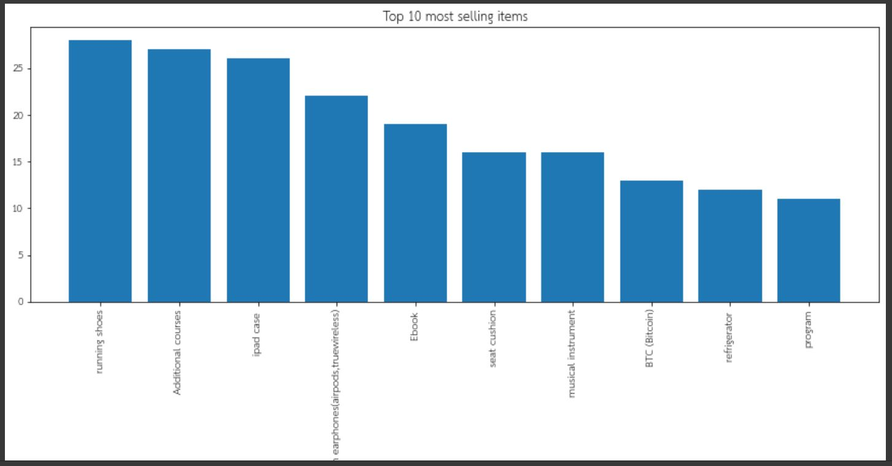
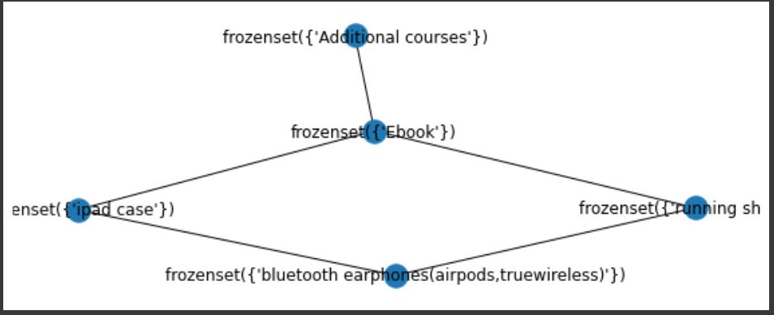
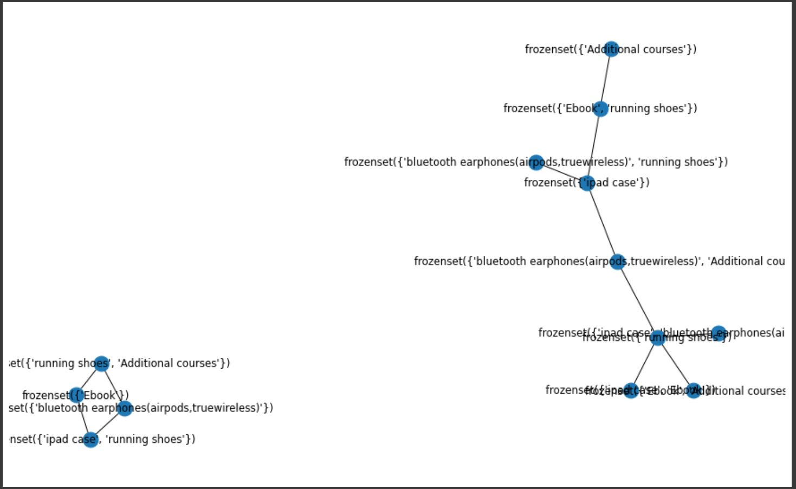
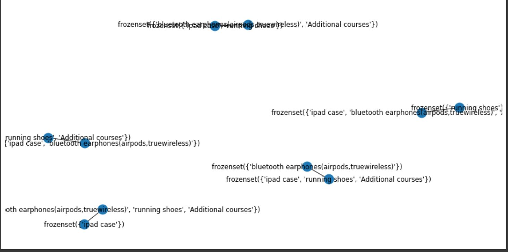

### product
 - โปรแกรมแท้                                
 - เครื่องซักผ้า                                                                
 - รองเท้าวิ่ง                               
 - ผักกรอบ                                    
 - คอร์สเรียนเสริม                            
 - nintendo switch                           
 - BTC (Bitcoin)                             
 - mechanical keyboard                        
 - เครื่องดูดฝุ่น Dyson                       
 - เคส ipad                                  
 - อโต๊ะปรับระดับ           
 - สินค้าจากพิมรี่พาย                        
 - I PHONE 13                                
 - หูฟัง bluetooth (airpods,truewireless)    
 - แก้วน้ำ Starbucks                          
 - เบาะรองนั่ง                               
 - เครื่องชงกาแฟแคปซูล                        
 - ตั๋วเครื่องบินไปญี่ปุ่น                   
 - Ebook                                     
 - ตู้เย็น                                    
 - กล้องฟิล์ม                                
 - เครื่องดนตรี                              
 - whey protein                             
 - วัตถุมงคล                                  
 - กระบองเพชรพูดได้                           
 - ROV Skin  

### Top 10 most selling items

 
 
 we can generate frequent item sets that have a support of at least 60 % usinf apriori:
 
    frequent_itemsets = apriori(hot_encoded_df, min_support=0.6, use_colnames=True)
    
 Generate the rules with their corresponding support, confidence and lift (build the rules) with association_rules  :
 
    rules = association_rules(frequent_itemsets, metric="lift", min_threshold=1)
    
    
  We can filter the dataframe using standard pandas code. In this case, look for a large lift (1) and high confidence (.8) :
  
    rules = rules[ (rules['lift'] >= 1) &
       (rules['confidence'] >= 0.8)]
       
  ### Interpret results
  
  #### Product Recommendation for 2 items
  
  
  
  #### Product Recommendation for 3 items
  
  
  
  #### Product Recommendation for 4 items
  
  
  
    
  
 
