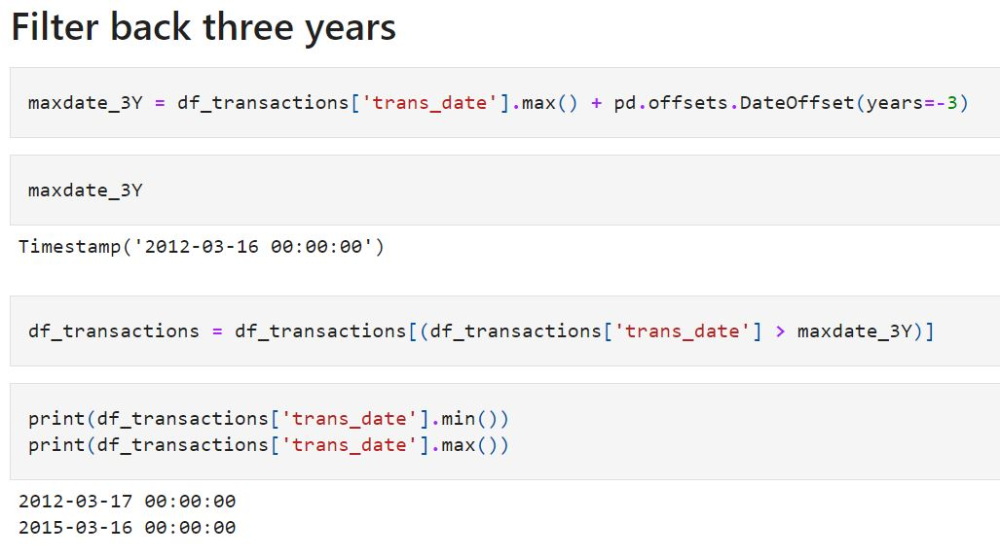

# Campaign Response Model

**Notebooks:** [Campaign_Response_Model](./Campaign_Response_Model.ipynb)  
**Google Colab:**   

## Data set : [Retail_Data_Response](./Retail_Data_Response.csv) [Retail_Data_Transactions](./Retail_Data_Transactions.csv) 

Use data set 3 years back

