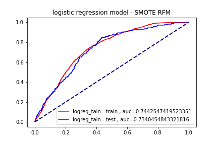
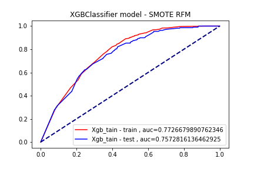

# Campaign Response Model
   

**Notebooks:** [Campaign_Response_Model](./Campaign_Response_Model.ipynb)  
**Google Colab:**   

## Data set : [Retail_Data_Response](./Retail_Data_Response.csv) [Retail_Data_Transactions](./Retail_Data_Transactions.csv) 

Use data set 3 years back

## Data Preparation

**RFM model**

- R (Recency) คือ ระยะเวลาที่ลูกค้ามาใช้บริการครั้งสุดท้าย ล่าสุดเมื่อไหร่
- F (Frequency) คือ ความถี่ที่ลูกค้ามาใช้บริการ
- M (Monetary) คือ จำนวนเงินทั้งหมดที่ลูกค้าใช้จ่าย

**Customer Lifetime Value (CLV) Model**

**Fixing imbalanced with SMOTE**
Problem imbalanced data

Use SMOTE in Train data of RFM and CLV

    sm = SMOTE(random_state=0)

    sm.fit(X_train_rfm, y_train_rfm)
    X_SMOTE_rfm, y_SMOTE_rfm = sm.fit_resample(X_train_rfm, y_train_rfm)

    sm.fit(X_train_clv, y_train_clv)
    X_SMOTE_clv, y_SMOTE_clv = sm.fit_resample(X_train_clv, y_train_clv)

## Result
**Logistic regression**

 

**XGBoost model**

XGBoost hyperparameter search using scikit-learn RandomizedSearchCV

 

 

## Conclusion

AUC of XGXGBClassifier model SMOTE is higher than Logistic regression model with SMOTE 

