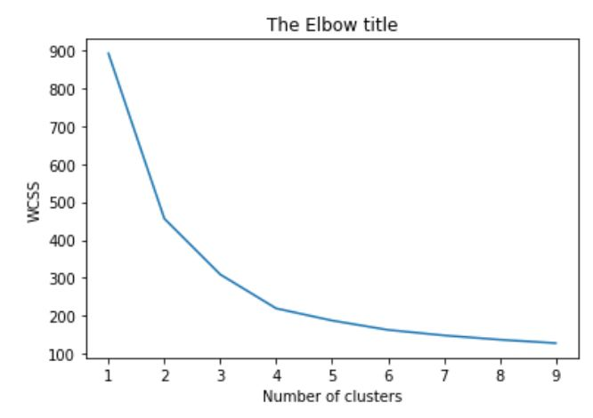
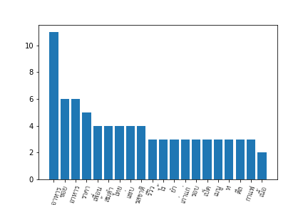
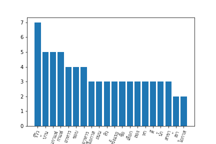
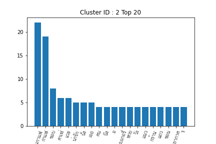
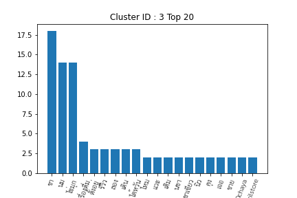
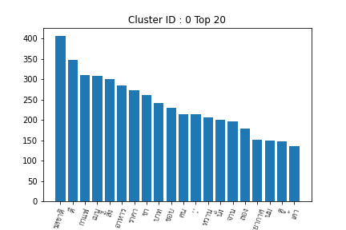
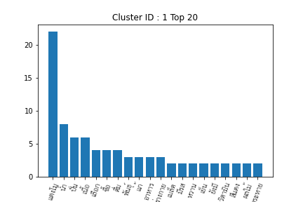
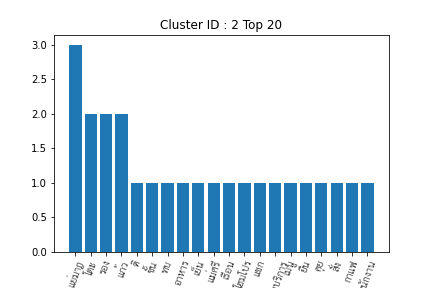
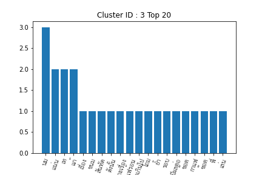

## Voice of Customer
   
  

**Data set :** [WongnaiReviews_Small](./WongnaiReviews_Small.csv) 

**Notebooks:** [Clustering_Documents_Universal_Sentence_Encoder_with_Clustering](./Clustering_Documents_Universal_Sentence_Encoder_with_Clustering.ipynb) 

## document clustering using KMeans

Run kmeans with various number of k. evaluate no. of k based on the elbow plot

Run kmeans with no. of clusters see fit the most  ==> no. 4

### Remove words 

    removed_words = ['u', 'b', 'n', 'nn', 'nn-', '\n', 'ร้าน','น','กิน','อร่อย','ทาน','ๆๆ','นะคะ','กา','บอ','ศ','ส','าน','รา','ข','น','กก','เม','ร้า','เ','อย','รี่',':','ท','ผม','สวัสดี','ดิชั้น','[',']','(',')','-','รับประทาน','tamp','nTamp','--',"']","['",'?',"']", 'โมง','เวลา','โอเค','และ','nn------------','review' ]

### Result 

  
  

### Result discussion

**Cluster ID : 0**

เกี่ยวกับร้านอาหาร การรีวิวร้านอาหาร ด้านรสชาติ ราคา เช่น ร้านส้มตำ ยำ

**Cluster ID : 1**

เกี่ยวกับการรีวิวร้านอาหาร ที่มีกาแฟด้วย

**Cluster ID : 2**

เกี่ยวกับร้านกาเฟ่ คาเฟ่ เบเกอรี่ ที่เป็นแนวน่ารัก สามารถนั่งรับประทานได้ บรรยากาศดี

**Cluster ID : 3**

เกี่ยวกับเครื่องดื่มประเภท ชานมไข่มุก ชาเขียว

## document clustering using Agglomorative Clustering with cosine similarity
### Result 
  
  

### Result discussion

**Cluster ID : 0**

เกี่ยวกับรสชาติ ราคา บรรยากาศ และการบริการของร้านอาหาร

**Cluster ID : 1**

เกี่ยวกับเครื่องดื่มประเภทปั่น แตงโมปั่นมีที่มีรสหวาน มีวิตามิน แก้กระหาย เย็น

**Cluster ID : 2**

เกี่ยวกับการรีวิวร้านอาหารในเรื่องที่ไม่พอใจ ซึ่งดูจากคำว่าแย่มาก

**Cluster ID : 3**  -
